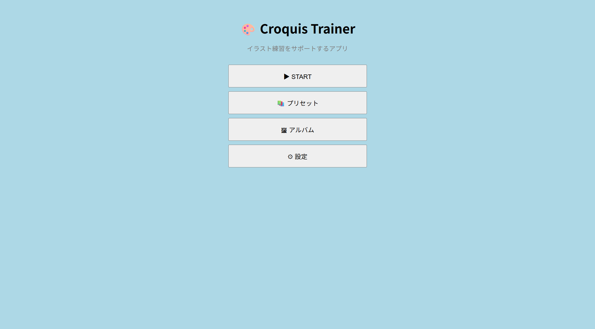
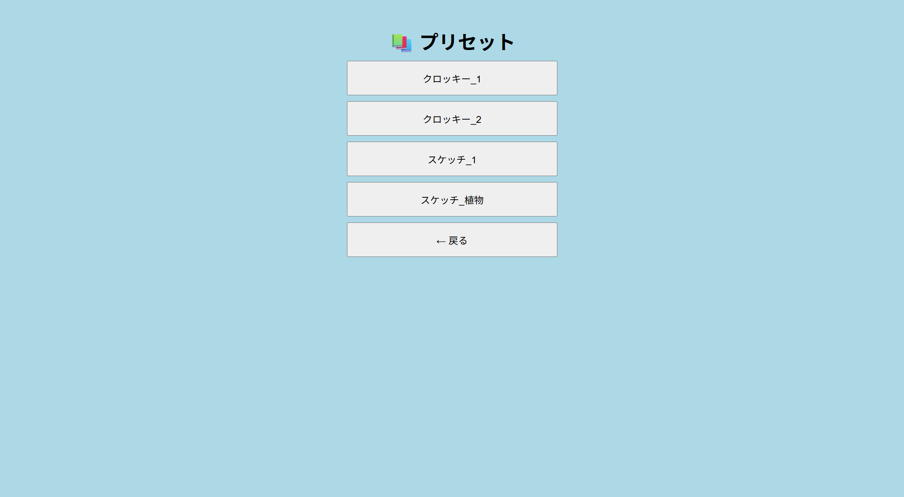
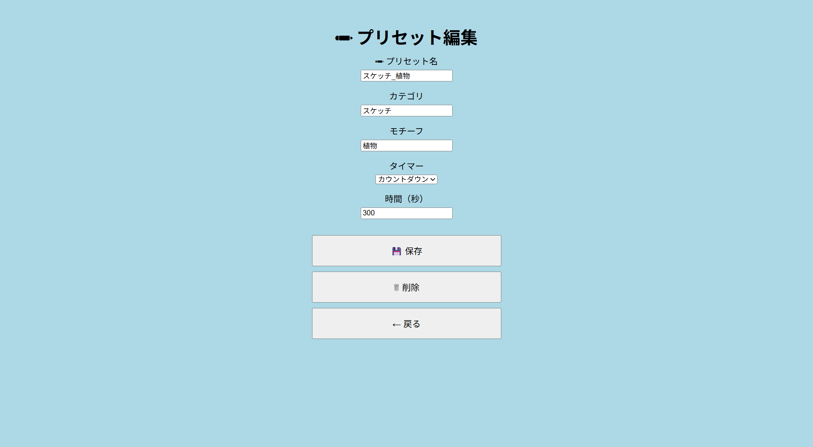
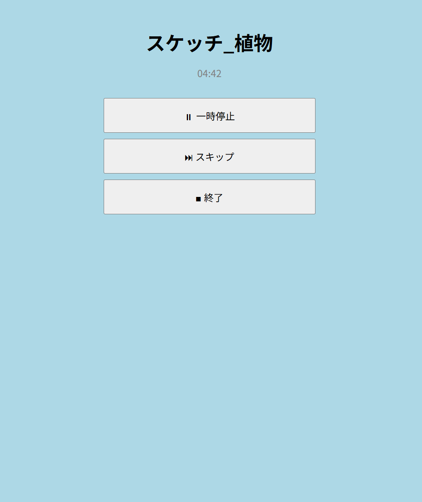
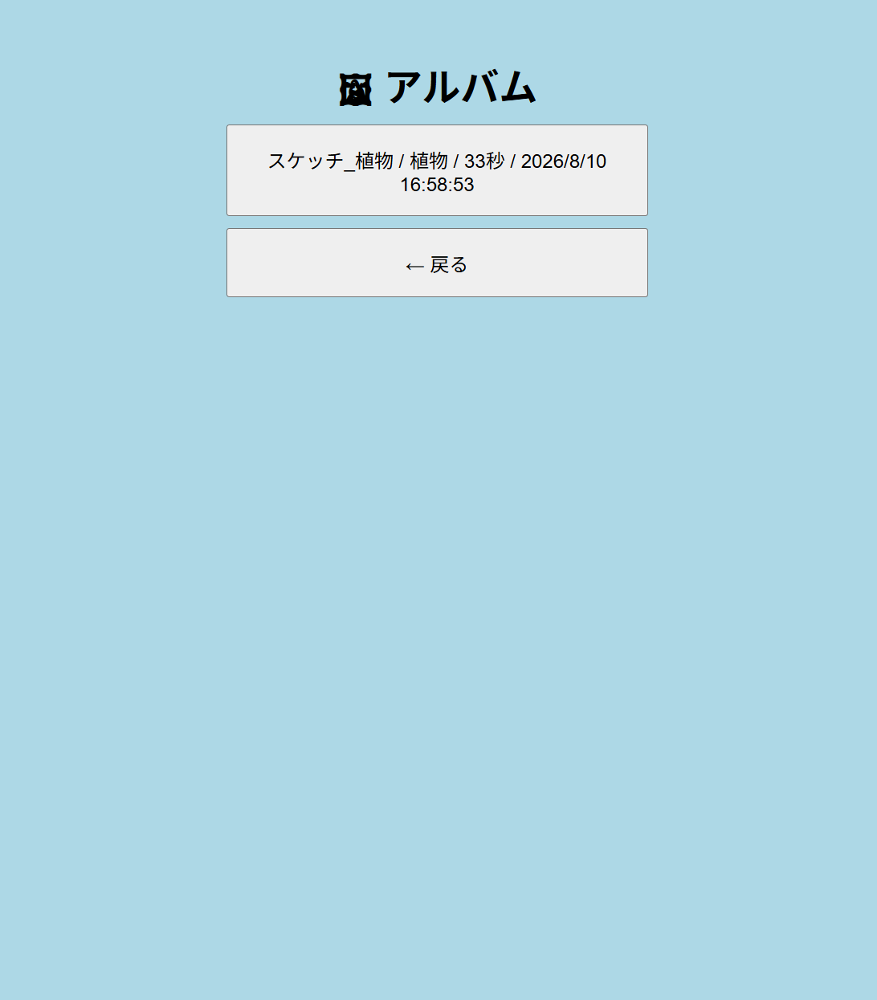

## 『Croquis Trainer』

アプリURL:https://mamatsu-710.github.io/CroquisTrainer/

## 概要
絵の練習内容と実働時間を記録・管理するWebアプリ

## 制作背景・目的
私は趣味でイラスト制作を行っており、絵の技術を向上させるため、日常的に人体クロッキーや静物スケッチ等の練習を行っています。

一方で、練習を継続する中で「自分がどのような技術を身につけたいのか」、「そのために何をすべきなのか」、といった練習の目的や内容をあらかじめ考えること自体を負担に感じ、明確な目的を設定しないまま筆を走らせてしまうこともあり、その結果「何を上達させるための練習なのか」が曖昧になってしまうことが課題となっていました。

そこで、練習を始める前に目的に応じた「練習メニュー」を設定し、その内容に沿って取り組める環境を作ることで練習の方向性を明確にできるのではないかと考えました。また、練習を継続するためには、取り組んだ内容を記録し、後から振り返りやすくすることも重要であると考えました。

これらを踏まえ、練習メニューの作成・管理、実働時間の計測、練習記録の保存・閲覧を一つのアプリケーションに集約しました。練習を開始するまでの負担を軽減し、明確な目的を持って練習に取り組みながらその成果を継続的に振り返ることのできる環境を構築することを目指し、本アプリを制作しました。

## 主な機能
〇練習メニュー（プリセット）の管理

練習内容を「プリセット」として登録し、繰り返し利用できます。プリセットには、練習名、カテゴリ、モチーフ、タイマー方式、設定時間などを登録できます。

- 新規プリセットの作成・保存
- 登録済みプリセットの選択・利用
- プリセットの編集・削除
- 新たに設定した練習内容を保存せず、そのまま練習を開始
- 新規の練習を終了した際、設定内容をプリセットとして保存するか選択

〇練習タイマー

設定した練習内容に応じて、以下のタイマー方式を選択できます。

- カウントダウン
- カウントアップ
- タイマーなし
- 練習中の一時停止・再開
- 一時停止時間を除いた実働時間の記録

〇練習記録・アルバム

練習終了時に練習内容や実働時間などを記録し、後から確認できます。

- 練習名、カテゴリ、モチーフの記録
- 実働時間・日時の記録
- アルバムによる練習記録の一覧表示
- 練習記録の詳細表示
- 不要な練習記録の削除

〇データ保存

ブラウザのlocalStorageを利用し、プリセットや練習記録を保存しています。ページを更新した場合でも、保存したデータを維持できるようにしています。

## 使用技術
- HTML：画面構造の作成
- CSS：レイアウト・デザイン
- JavaScript：画面遷移、タイマー、プリセット・練習記録の管理
- localStorage：プリセット・練習記録の保存

## 工夫した点
1. 練習メニュー（プリセット）の設計

本アプリでは、練習内容を「プリセット」として登録し、繰り返し利用できるようにしています。プリセットには、練習名、カテゴリ、モチーフ、タイマー方式、設定時間などを登録でき、保存したプリセットを一覧から選択して練習を開始できます。また、登録後のプリセットは内容の編集や削除も可能です。

新しく練習内容を設定した場合でも、新規プリセットとして保存せずにそのまま練習を開始することができます。そして、その練習を終了した際には、新たに設定した内容を今後も利用するためにプリセットとして保存するかを選択できるようにしています。

これにより、あらかじめ練習メニューを登録して繰り返し利用する場合と、その場で設定した練習にすぐ取り組む場合の双方に対応できるようにしました。

2. 練習タイマーの実装と実働時間の記録

練習タイマーには、カウントダウン、カウントアップ、タイマーなしの3種類を用意し、練習内容に応じて使い分けられるようにしました。また、練習中の一時停止・再開にも対応し、一時停止していた時間を除いた実働時間を練習記録として保存する仕様としています。

実装後は実際にアプリを操作し、タイマーの動作だけでなく、練習終了後に記録される実働時間についても確認しました。その過程で一時停止・再開を行った際に、画面上のタイマーは正常に動作しているにもかかわらず、アルバムに保存される実働時間が正しく反映されない問題を確認しました。

そこで、実働時間の記録方法を修正し、カウントダウン・カウントアップのそれぞれについて、一時停止・再開を含む複数の条件で動作確認を行いました。

3. 実際の操作を通した機能改善

開発中は個々の機能が単独で動作することだけでなく、練習開始から終了、記録までの流れを実際に操作し、一連の利用手順に問題がないか確認しました。

その中で、新規の練習内容を設定した後にプリセットとして保存せず練習を開始した場合、練習終了後にその内容を保存できない問題を確認しました。そこで、新規に設定した練習内容と、すでに保存されているプリセットを区別して扱い、未保存の練習が終了した際にプリセットとして保存するか選択できるように改善しました。

このように、実装した機能を実際に使用することで操作上の問題を発見し、仕様や処理を見直すことで改善を行いました。

## 今後の改善
- 練習した制作物のサムネイル保存
- タイマー設定を時・分・秒単位で指定できる機能
- アプリの設定画面の追加
- アプリ全体のUIの改善

<h3>ホーム画面</h3>

<h3>プリセット一覧</h3>

<h3>プリセット詳細</h3>

<h3>練習中</h3>

<h3>アルバム</h3>

